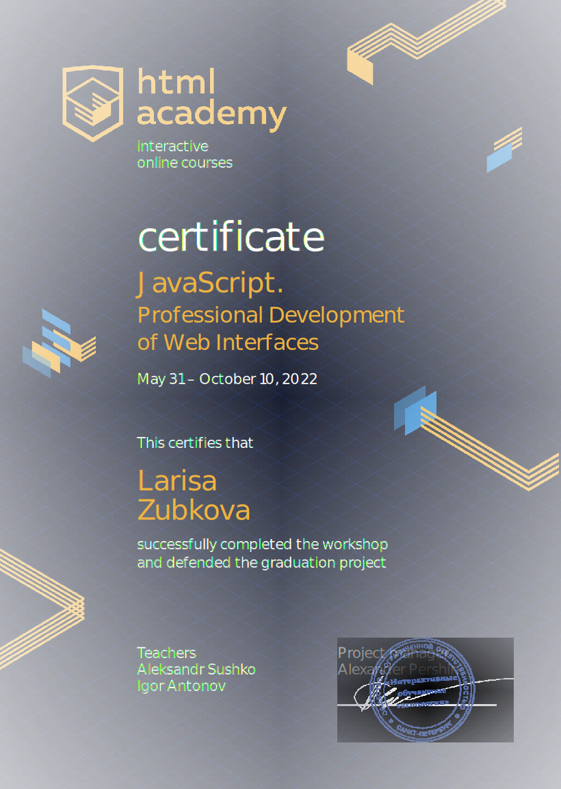
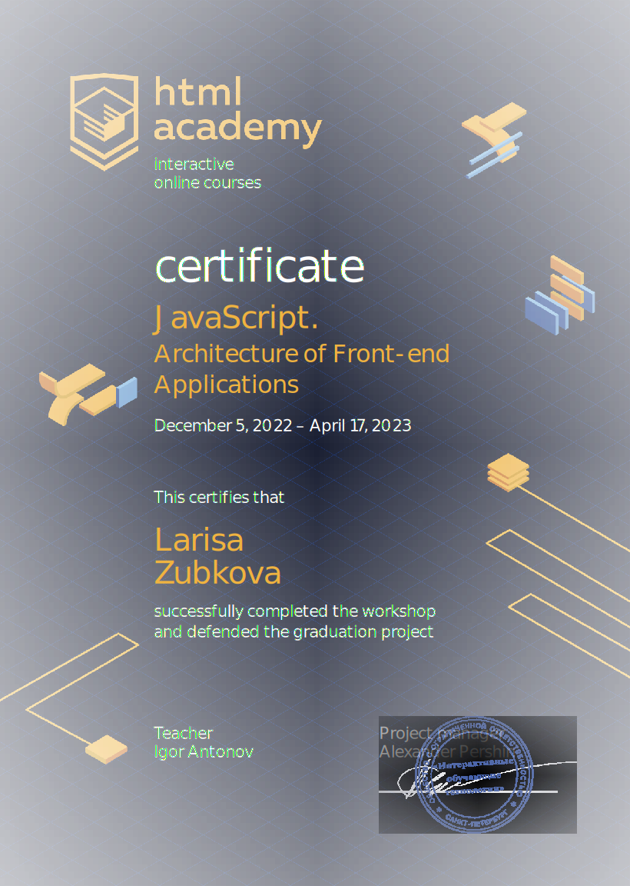

## 
HI, I'm Larissa, a React developer 🏃‍♀️
  
 

 

-  I’m studying at the [HTML Academy](https://htmlacademy.ru/profile/id2041971) for the profession of a React developer  
  

- I speak Japanese, running marathons, take dance lessons  
  

- ⚡ Fun fact: I always wanted to become a programmer, but I got an education as a civil engineer  
  

   

## My Skill Set  

### Frontend  

  
  
  
  
  
  
  
  
  
  
  
  
  

   

## Github Stats  

  

   

## Certificates

